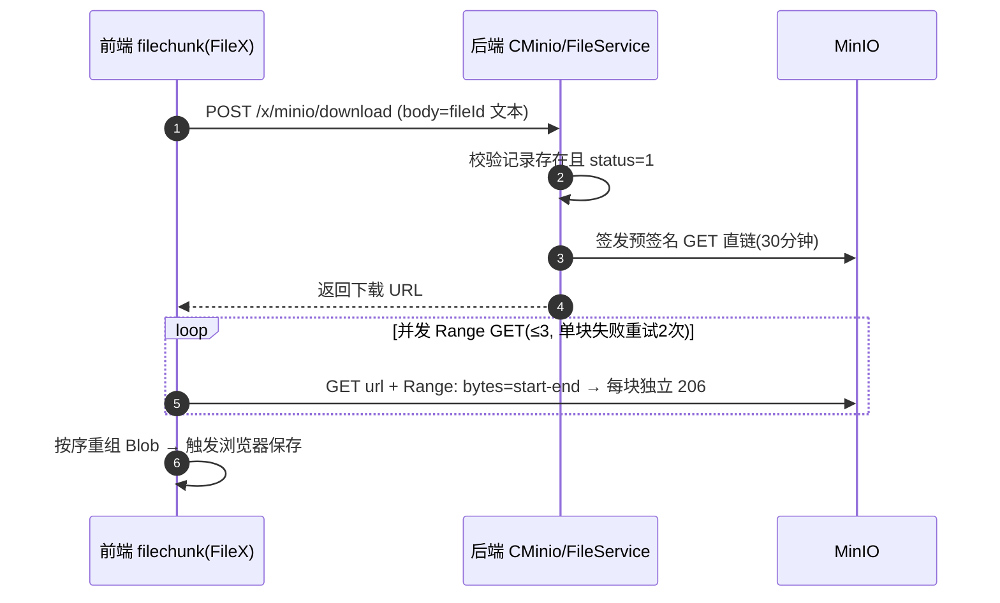

# 文件分块传输流程（前端 / 后端 / MinIO）

> 更新日期：2026-09-09
> 关联代码：前端 `src/framework/services/net/FileX.js`、测试页 `src/cms/smlj/filechunk/`；后端 `CMinio.java`、`FileService.java`、`MinoUtil.java`；MinIO 地址 `10.8.54.24:9000`，bucket `store`。

## 0. 一句话架构

**文件字节流永远在「浏览器 ⇄ MinIO」之间直传，后端不碰字节**，只做三件事：签 URL、管 DB 状态、在 MinIO 服务端做合并。所有后端业务接口用 POST；仅分块字节直传/拉取时 MinIO 强制 PUT 与 Range-GET（协议无法绕过）。

```
浏览器  ──PUT 分块 / Range-GET──▶  MinIO
   │                                 ▲
   │ POST 业务接口(签名/状态/合并)      │ 服务端操作(compose/delete/list)
   ▼                                 │
 后端(CMinio → FileService → MinoUtil ─┘
   │
   ▼
 MySQL(t_file)
```

## 1. 三方职责

| 角色 | 职责 | 关键文件 |
|---|---|---|
| 前端浏览器 | 切块、算 MD5、拿直链后并发直传/直拉、进度与重试、重组 | `FileX.js`、`pages/smlj/filechunk/` |
| 后端 | 签发预签名 URL、查/建 DB 记录、exists 探测、complete 时对账并触发服务端合并、abort 清理 | `CMinio.java` → `FileService.java` |
| MinIO | 实际存储字节；支持对象级 PUT / Range-GET / list / compose / delete | 经 `MinoUtil.java` 封装 |

**设计原则**：后端只签 URL 与编排状态，字节不进后端 → 省后端带宽、天然支持大文件；代价是后端无法逐字节校验内容，只能靠 complete 时"块数 + 总大小"对账。

## 2. 对象键布局与 DB 状态

| 角色 | 对象键 / 表 | 说明 |
|---|---|---|
| 最终文件 | `{fileId}/{原文件名}` | 合并后的正式对象；预览、整文件下载都指向它 |
| 临时分块 | `{fileId}/parts/00000` ~ `99999` | 上传中前端逐块 PUT 的目标，complete 后删除 |
| DB | `t_file` 一行 | `upload_status`: 0=上传中 / 1=完成 / 2=已删；`file_md5` 为秒传/续传判据 |

## 3. 分块上传流程

```mermaid
sequenceDiagram
    autonumber
    participant FE as 前端 filechunk(FileX)
    participant BE as 后端 CMinio/FileService
    participant MO as MinIO
    participant DB as MySQL t_file

    FE->>FE: md5ByChunks 边切块边算整文件 MD5(避免二次读文件)
    FE->>BE: POST /x/minio/chunk/begin {file_name,file_size,file_md5,chunk_size}
    BE->>DB: 按 file_md5 查记录
    alt status=1 已传完成 → 秒传
        BE-->>FE: is_exist=true, 前端直接提示成功
    else status=0 中断残留 → 续传(复用原 fileId)
        BE->>MO: listObjects({fileId}/parts/) 探测已传分块
        Note over BE: 逐块比对 size 标记 exists=true;<br/>残留首块 ≠ 本次 chunk_size(换过块大小)<br/>→ 先清空残留再全量签发(自愈)
        BE-->>FE: parts=[{index,url,exists}]
    else 无记录 → 新建
        BE->>DB: insert t_file(status=0, fileId=UUID 无横线)
        BE-->>FE: parts=[{index,url,exists=false}]
    end
    loop 并发 ≤3, 仅传 exists=false 的缺失块
        FE->>MO: PUT {fileId}/parts/xxxxx(预签名直传, 单块失败自动重试2次)
    end
    FE->>BE: POST /x/minio/chunk/complete (body=fileId 文本)
    BE->>MO: listObjects 对账: 块数 + 总大小 == DB file_size
    BE->>MO: composeObject 把 parts/* 按名序服务端合并 → {fileId}/原名
    BE->>MO: deleteObjectsByPrefix 清理 {fileId}/parts/*
    BE->>DB: update status=1
    BE-->>FE: 返回成功
```

### 步骤说明

| 阶段 | 谁 | 做什么 | 关键点 |
|---|---|---|---|
| ① | 前端 | `md5ByChunks` 边切边算整文件 MD5 | 秒传 / 断点续传的判据；`file_md5` 为空则退化为每次新建记录 |
| ② | 前端→后端 | `POST /chunk/begin` | 后端按 MD5 分三路：`status=1` 秒传 / `status=0` 续传 / 无记录新建 |
| ③ | 后端→MinIO | `listObjects` 探测已传分块并逐块比对 size | `exists=true` 只标"完整"的分块；尺寸不符视为未传 |
| ④ | 后端 | 自愈：残留首块 ≠ 本次 `chunk_size` → 先按前缀清空再全量签发 | 防止换了块大小后 merge 对账误判 |
| ⑤ | 后端→前端 | 返回每块预签名 PUT 直链 + `exists` | 有效期 2 小时（分块耗时 > 普通直传的 30 分钟） |
| ⑥ | 前端→MinIO | 并发 PUT（≤3，单块失败重试 2 次），`exists=true` 跳过 | 字节直传，不经后端；断点续传落点 |
| ⑦ | 前端→后端 | `POST /chunk/complete` | 后端 `listObjects` 对账 |
| ⑧ | 后端→MinIO | `composeObject` 服务端合并 + 删 `parts/*` | 数据在 MinIO 内部搬运，不回流后端 |
| ⑨ | 后端→DB | `status=1` | 完成后与整文件直传产物一致 |

### 约束与边界

- **5MB 下限**：`composeObject` 是 S3 语义，除最后一块外每块必须 ≥ 5MB。因此 `file ≤ chunk_size` 时前端判定为单块，**直接 PUT 最终对象键**，绕开合并限制（后端无临时分块）。
- **块数 ≤ 10000**：分块序号 `%05d` 上限，页面参数校验保证。
- **续传一致性**：续传要求 `chunk_size` 与上次一致；中途改大改小由 ④ 自愈全量重传。
- **上传中断**：临时分块残留 MinIO，可调用 `POST /chunk/abort`（页面"中止并清理"）释放。

## 4. 分块下载流程



### 步骤说明

| 阶段 | 谁 | 做什么 | 关键点 |
|---|---|---|---|
| ① | 前端→后端 | `POST /x/minio/download` | 与整文件下载同一接口，body 为 fileId 文本 |
| ② | 后端 | 校验 `status=1` → 签发 GET 直链 | 30 分钟有效 |
| ③ | 前端→MinIO | 并发 Range GET，每块独立 `206` | 预签名是 query 签名，Range 头不参与签名，直接可用 |
| ④ | 前端 | 内存按序重组 Blob | **不落盘**，刷新/关闭即丢（见 §6） |

## 5. 与整文件链路的关系（filetest ⇄ filechunk）

项目里存在两套平行链路，**产物完全一致**：

| 维度 | 整文件直传（filetest 演示） | 分块传输（filechunk） |
|---|---|---|
| 流程 | `beginUpload → 直传 → endUpload` | `chunk/begin → 并发 PUT → chunk/complete` |
| 最终产物 | `{fileId}/原名` + `t_file(status=1)` | 同左（merge 后一致） |
| 适用 | 小文件 | 大文件（内存受限 / 网络不稳） |
| 断点续传 | 靠"秒传"（整文件已存在则跳过） | 分块级 exists 跳过（见 §6） |

> 由于产物格式一致，fileview 列表可直接预览两边上传的文件，架构上天然兼容。

## 6. 断点续传支持现状

| 方向 | 支持情况 | 机制 |
|---|---|---|
| 分块上传 | ✅ 真断点续传 | 后端 exists 探测（listObjects 逐块比对 size）+ 前端跳过已传块 + PUT 覆盖写幂等 |
| 分块下载 | ❌ 不支持 | 重组 Blob 仅存内存，刷新即丢；需 OPFS/File System Access 落盘才能续（未实现） |

**上传续传走通路径**：中断 → 重试同一文件 → MD5 命中 `status=0` 复用原 fileId → begin 返回每块 exists → 只补传缺失块 → complete 合并。无需手动 abort。

## 7. 接口清单

| Method | Path | Body / 说明 | 时效 |
|---|---|---|---|
| POST | `/x/minio/chunk/begin` | `{file_name,file_size,file_md5,chunk_size}` → 返回 parts 直链 + exists | 分块 PUT 直链 2h |
| POST | `/x/minio/chunk/complete` | fileId 文本；对账后服务端 merge | — |
| POST | `/x/minio/chunk/abort` | fileId 文本；清残留分块 + DB 记录 | — |
| POST | `/x/minio/download` | fileId 文本 → 下载直链（分块/整文件通用） | GET 直链 30min |
| POST | `/x/minio/begin` / `/end` / `/delete` | 整文件直传三件套 | PUT 直链 30min |
| PUT | MinIO 直传（预签名 URL） | 分块字节，浏览器直传 | MinIO 强制 PUT |
| GET | MinIO 直拉（预签名 URL + Range） | 分块字节，浏览器直拉 | 支持 206 |

## 8. 涉及文件索引

**前端（ft-checnote）**
- `src/framework/services/net/FileX.js` — 框架层：`chunkUploadFile` / `chunkDownloadFile` / `md5ByChunks` / `putPartToMinio` / `getRange` / `runPool` 并发池
- `src/cms/smlj/filechunk/App.vue` + `main.js` — 独立测试页（参数、上传、分块状态表、列表下载/删除）
- `pages/smlj/filechunk/index.html` + `vite.config-mpa.js` 入口注册

**后端（single-device-note）**
- `core/controller/CMinio.java` — `POST /x/minio/chunk/*`、`/x/minio/download` 等
- `core/service/FileService.java` — `beginChunkUpload`(L62) / `completeChunkUpload`(L203) / `abortChunkUpload`(L263)，复用 `beginUpload/endUpload/getDownloadUrl`
- `core/utils/MinoUtil.java` — `listObjects`(L187) / `composeObjects`(L213) / `deleteObjectsByPrefix`(L240) / `doesObjectExist`(L69)
- `core/o/dto/file/FileChunk{BeginDTO,PartDTO,BeginResultDTO}.java` — 分块 DTO（`FileChunkPartDTO.exists` 为续传标记）
